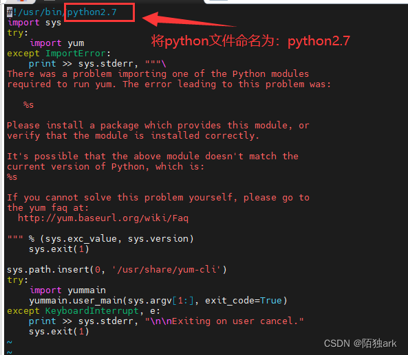
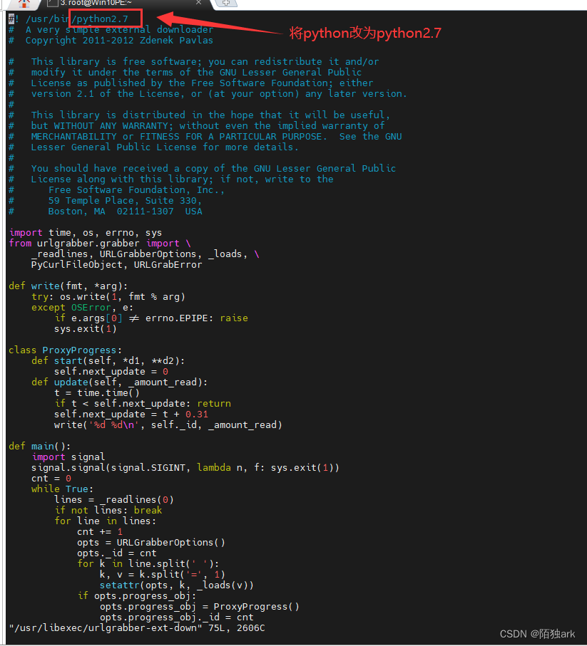

# 参考链接

<https://blog.csdn.net/m0_66724697/article/details/133981039>  

## 安装 libffi 开发库和 zlib1g-dev 包

它们是 Python 编译和运行的额外依赖项

```bash
sudo yum install -y libffi-devel zlib1g-dev
```

## 安装所有以 "zlib" 开头的软件包，以满足可能的 zlib 依赖项

```bash
sudo yum install zlib* -y
```

## 下载python安装包

```bash
wget https://www.python.org/ftp/python/3.10.1/Python-3.10.1.tgz
```

## 解压文件夹

```bash
tar -xvf Python-3.10.1.tgz
```

## 创建 Python 3.10 的安装目录

```bash
sudo mkdir /usr/local/python3
```

## 升级GCC版本

```bash
sudo yum install -y centos-release-scl
sudo yum install -y devtoolset-8-toolchain
```

## 启用新的工具链

```bash
sudo scl enable devtoolset-8 bash
```

## 编译安装python 3.10

```bash
cd Python-3.10.1
```

## 运行 Python 配置脚本，配置编译参数

```bash
sudo ./configure --prefix=/usr/local/python3 --with-openssl=/usr/bin/openssl --enable-shared --enable-optimizations
```

## 编译 & 安装

make 命令会根据配置参数编译源代码并生成可执行文件  

```bash
sudo make 
sudo make install
```

## 创建软链接以将 Python 3.10 与 python3 和 pip3 关联

```bash
# 备份系统默认的 /usr/bin/python 可执行文件
sudo mv /usr/bin/python /usr/bin/python.bak

# 创建软链接，将 /usr/local/python3/bin/python3 关联到 /usr/bin/python3，使 python3 命令可用
sudo ln -s /usr/local/python3/bin/python3 /usr/bin/python3

# 备份系统默认的 /usr/bin/pip 可执行文件
sudo mv /usr/bin/pip /usr/bin/pip.bak

#　创建软链接，将 /usr/local/python3/bin/pip3 关联到 /usr/bin/pip3，使 pip3 命令可用
sudo ln -s /usr/local/python3/bin/pip3 /usr/bin/pip3

# 向 /etc/ld.so.conf 文件中添加新的库路径
sudo echo "/usr/local/python3/lib" >> /etc/ld.so.conf
# 如果上一句命令报错，尝试下面这句命令
sudo sh -c "echo '/usr/local/python3/lib' >> /etc/ld.so.conf"
sudo ldconfig -v

# 覆盖现有Python
sudo mv /usr/bin/python /usr/bin/python2_old
sudo mv /usr/bin/pip /usr/bin/pip2_old

#　修改软链接
sudo ln -s /usr/local/python3/bin/python3 /usr/bin/python
sudo ln -s /usr/local/python3/bin/pip3 /usr/bin/pip
```

## 修复yum

```bash
# 找到yum的路径，这里的结果是 /usr/bin/yum
which yum

# 找到上次用软链接所备份的python2的bak文件，进行重命名
cd /usr/bin
sudo mv python.bak python2

# 检查重命名
sudo find / -name python2

# 编辑yum使用路径和/usr/libexec/urlgrabber-ext-down的指向都为python2
sudo vim /usr/bin/yum
sudo vim /usr/libexec/urlgrabber-ext-down

# 检查yum
yum

# 检查python版本
python -V
```




## 修复pip

```bash
# 备份当前的yum源
sudo mv /etc/yum.repos.d /etc/yum.repos.d.backup4comex

# 新建空的yum源设置目录
sudo mkdir /etc/yum.repos.d

# 下载阿里云的yum源配置
sudo wget -O /etc/yum.repos.d/CentOS-Base.repo http://mirrors.aliyun.com/repo/Centos-7.repo

# 重建缓存
yum clean all
yum makecache

# 修复pip
cd /usr/bin
sudo mv pip pip.bak
sudo ln -s /usr/local/python3/bin/pip3 /usr/bin/pip

# 验证pip
pip -V
```
