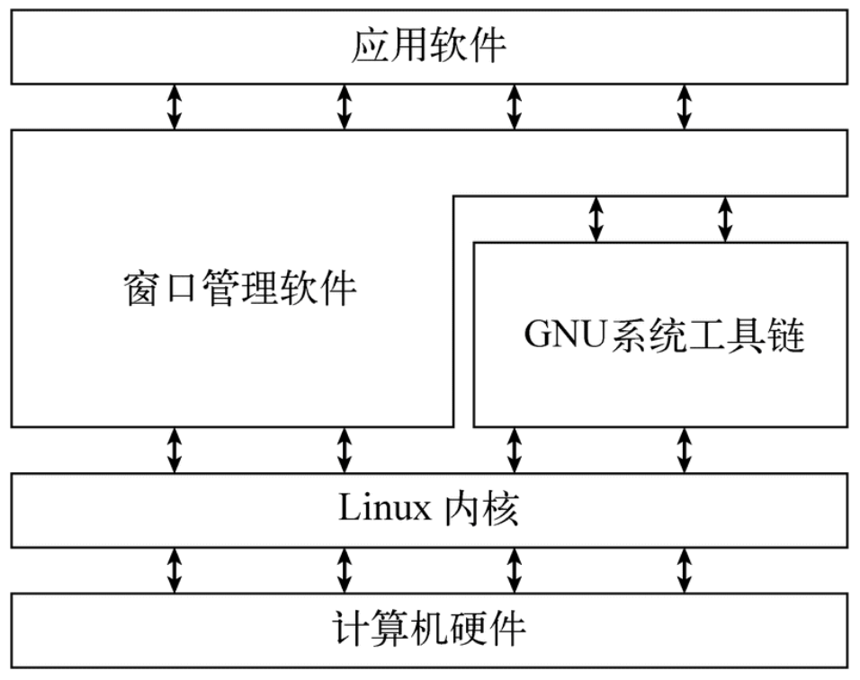
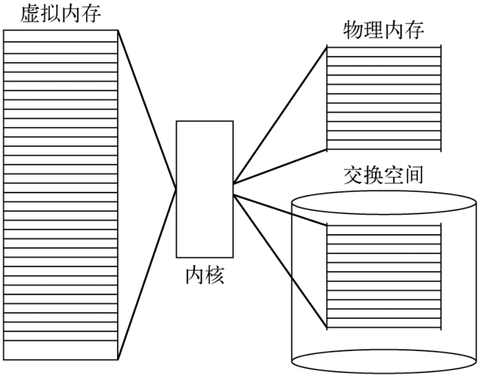
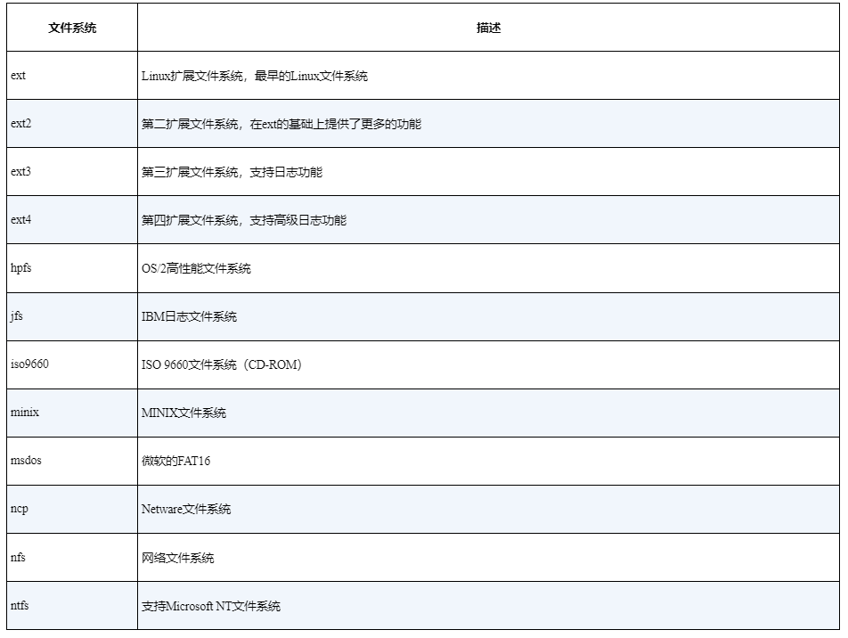
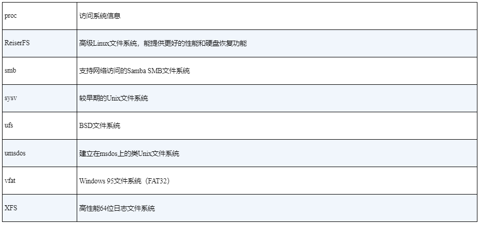
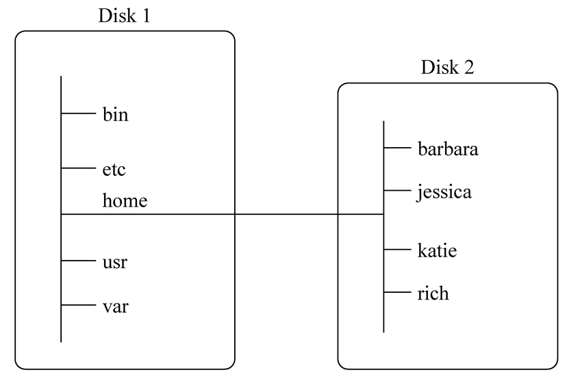
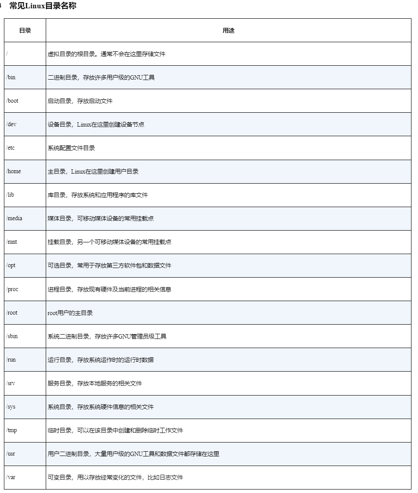
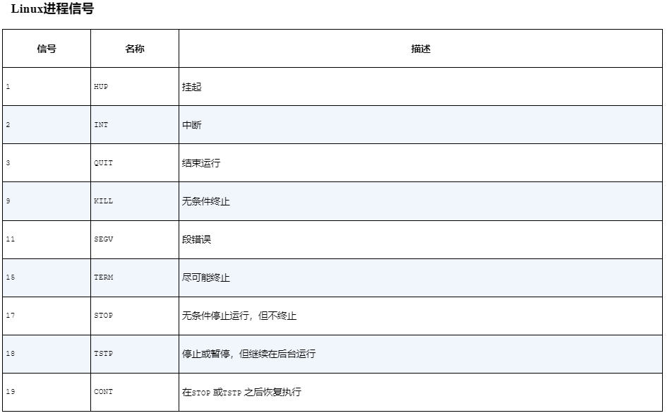
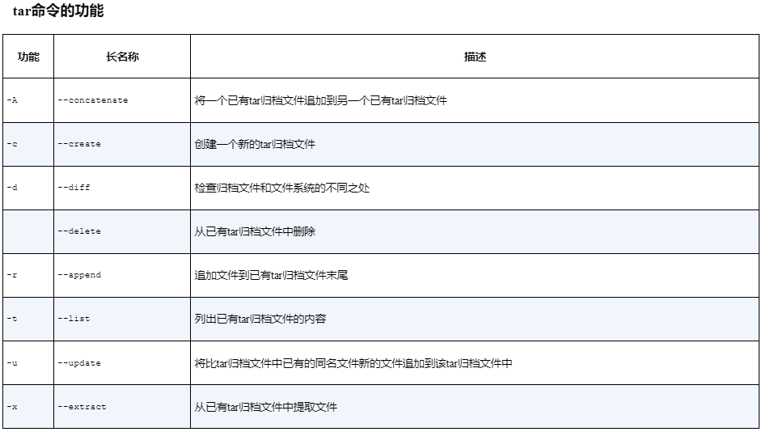

# Part 1 Linux command line

## chapter 1 Linux shell

### 1.1 什么是 Linux

Linux 可以划分为以下四部分：

- Linux 内核
- GUN 工具
- 图形化桌面环境
- 应用软件



#### 1.1.1 Linux 内核

Linux 系统的核心是 内核，内核控制计算机系统上所有硬件和软件，在必要时分配硬件，并根据需要执行软件  

内核主要负责功能：

- 系统内存管理
- 软件程序管理
- 硬件设备管理
- 文件系统管理

##### 1.1.1.1 系统内存管理

- 管理物理内存
- 创建和分配虚拟内存 -- 通过硬盘上的存储空间来实现虚拟内存，这块区域称为 交换空间 swap space



页面 (page): 内存存储单元按组划分成很多块，这些块称作 页面 ， 内核将每个内存页面放在 物理内存 或 交换空间
内核会维护一个 内存页面表 ， 指明哪些页面位于物理内存，哪些页面被换到磁盘上  

##### 1.1.1.2 软件程序管理

进程 ： 运行中的程序

内核创建第一个进程 (init进程) 来启动系统上的其他进程

一些Linux发行版使用一个表管理开机时要自动启动的进程，通常位于 /etc/inittab
另一些系统将开机时启动或停止某个应用的脚本存在在特定目录下，通常为 /etc/init.d 目录

##### 1.1.1.3 硬件设备管理

任何Linux系统需要与之通信的设备，都需要在内核代码中加入其驱动程序代码  
驱动程序代码相当于应用程序和硬件设备的中间人，允许内核与设备之间交换数据

两种方法用于插入设备驱动代码：

- 编译进内核的设备驱动代码 -- 每次添加新设备需要重新编译内核代码
- 可插入内核的设备驱动代码

硬件设备被当成特殊的文件，称为 设备文件 ， 有3种分类：

- 字符型设备文件 -- 处理数据每次只能处理一个字符
- 块设备文件 -- 每次能处理大块数据的设备，如硬盘
- 网络设备文件 -- 采用数据包发送和接收数据的设备，包括各种网卡和一个特殊的回环设备

Linux为系统上的每个设备都创建一种称为 节点 的特殊文件。与设备的所有通信都通过设备节点完成。
每个节点都有唯一的 数值对 供Linux内核标识它。
数值对包括一个 主设备号 和一个 次设备号 。类似的设备被划分到同样的主设备号下，次设备号用于标识主设备组下的某个特定设备

##### 1.1.1.4 文件系统管理

内核必须在编译时加入对所有可能用到的文件系统的支持  




Linux内核采用 虚拟文件系统(Virtual File System, VFS)作为和每个文件系统交互的接口

#### 1.1.2 GUN工具

除由内核控制硬件设备外，操作系统用于执行一些标准功能的工具，如用于控制文件和程序

##### 1.1.2.1 核心GUN工具

GUN coreutils软件包：

- 用于处理文件的工具
- 用于操作文本的工具
- 用于管理进程的工具

##### 1.1.2.2 shell

GUN/Linux shell 是一种特殊的交互式工具
为用户提供了启动程序、管理文件系统种的文件以及运行在Linux系统上的进程的途径
其核心是命令行提示符

##### 1.1.2.3 Linux 桌面环境

- X Window系统
- KDE(K Desktop Environment) 桌面
- GONME(the GNU Network Object Model Environment) -- 很多Linux发行版默认的桌面环境，用得最多的是 Red Hat Linux
- Unity 桌面 -- Ubuntu
- 其他桌面: Fluxbox, Xfce, JWM, Fvwm, fvwm95 ...

## 1.2 Linux发行版

完整的Linux系统包称为发行版

不同的Linux发行版通常归类为3种：

- 完整的核心Linux发行版 -- 含有内核、一个或多个图形化桌面环境以及预编译好的几乎所有能见到的Linux应用
- 特定用途的发行版 -- 基于某个主流发行版，但仅包含主流发行版中一小部分用于某种特定用途的应用程序
- LiveCD测试发行版 -- 一些Linux发行版创建了含有Linux样本系统（称为Linux LiveCD）的可引导CD，通过CD来启动PC，并且无需在硬盘安装任何东西就能运行Linux发行版

## chapter 2 走进shell

Linux控制台终端
各类终端仿真器

## chapter 3 基本的 bash shell 命令

### 3.1 文件系统

Linux将文件存储在单个目录结构中，这个目录被称为 虚拟目录(virtual directory)
虚拟目录将安装在PC上的所有存储设备的文件路径纳入单个目录结构中

Linux虚拟目录中比较复杂的部分是它如何协调管理各个存储设备。
在Linux PC上安装的第一块硬盘称为<B>根驱动器</B> 。根驱动器包含了虚拟目录的核心，其他目录都是从那里开始构建的。
Linux会在根驱动器上创建一些特别的目录，我们称之为<B>挂载点 （mount point）</B>。
挂载点是虚拟目录中用于分配额外存储设备的目录。虚拟目录会让文件和目录出现在这些挂载点目录中，然而实际上它们却存储在另外一个驱动器中。
通常系统文件会存储在根驱动器中，而用户文件则存储在另一驱动器中





### 3.2 文件和列表

| 命令 | 参数 | 作用 |
| :-: | :-: | :-: |
| ls | | 显示当前目录下的文件和目录 |
| ls | -F | 区分文件和目录，目录后有 / ， 可执行文件有 * |
| ls | -a | 显示隐藏文件和普通文件 |
| ls | -R | 递归选项，列出当前文件目录下包含的子目录中的文件 |
| ls | -l | 长列表，文件类型，权限，链接数，文件属主，属主组的组名，大小，修改时间，文件名或目录名 |
| ls | -d | 只列出目录本身的信息 |
| ls | -i | 显示inode编号 |

可以通过 ls 加入过滤器过滤文件

```bash
ls -l my_script # 指定特定文件
ls -l my_scr?pt  # ? 代表一个字符
ls -l my_scr*pt  # * 代表零个或多个字符
ls -l my_scr[ai]pt # [] 指定字符范围
ls -l my_scr[!a]pt  # ! 排除字符
```

### 3.3 处理文件

#### 3.3.1 创建和移动

| 命令 | 参数 | 作用 |
| :-: | :-: | :-: |
| touch | | 创建空文件 |
| cp source destination | | 复制文件， destination可以是文件名和目录名 |
| cp source destination | -i | 复制文件，强制shell询问是否需要覆盖已有文件 |
| cp source destination | -R | 递归地复制，整个目录的内容 |

#### 3.3.2 链接文件

如需要在系统上维护同一文件的两份或多份副本，除了保存多份单独的物理文件副本之外，还可以采用保存一份物理文件副本和多个虚拟副本的方法。这种虚拟的副本就称为链接 。链接是目录中指向文件真实位置的占位符

两种类型的文件链接：

- 符号链接 -- 类似于对原始文件的引用，指向源文件
- 硬链接 -- 会创建独立的虚拟文件，其中包含原始文件的信息和位置，本质上是同一个文件

| 命令 | 参数 | 作用 |
| :-: | :-: | :-: |
| ln | | 不带参数默认创建硬链接，通过inode进行链接 |
| ln | -s | 创建符号链接 |

只有在同一文件系统中的文件之间才能创建硬链接，不能对目录进行创建

#### 3.3.4 重命名文件 -- 移动

| 命令 | 参数 | 作用 |
| :-: | :-: | :-: |
| touch | | 创建空文件 |
| mv source destination | | 移动文件， destination为文件时重命名，为目录时移动 |
| mv source destination | -i | 强制shell询问是否需要覆盖已有文件 |

#### 3.3.5 删除文件

| 命令 | 参数 | 作用 |
| :-: | :-: | :-: |
| rm| -i | shell询问是否要删除文件  |

### 3.4 处理目录

| 命令 | 参数 | 作用 |
| :-: | :-: | :-: |
| mkdir | | 创建目录 |
| mkdir | -p | 同时创建多个目录和子目录 |
| rmdir |  | 默认只删除空目录 |
| rm |  -ri | 递归删除 |

### 3.5 查看文件内容

| 命令 | 参数 | 作用 |
| :-: | :-: | :-: |
| file | | 查看文件类型 |
| cat | | 查看文件内容 |
| cat | -n | 加上行号显示 |
| cat | -b | 只给有文本的行加上行号 |
| cat | -T | 除去制表符 |
| more |  | 分页工具，只支持文本文件中的基本移动 |
| less |  | more的升级版 |
| tail |  | 查看后几行，默认10行 |
| tail | -n [数字] | 指定查看的行数 |
| tail | -f | 允许你在其他进程使用该文件时查看文件的内容。tail 命令会保持活动状态，并不断显示添加到文件中的内容, 可以用于实时监测系统日志 |
| head |  | 查看前几行，默认10行 |
| head | -n [数字] | 指定查看的行数 |

## chapter 4 更多 bash shell 命令

进程，磁盘，数据的排序和归档

### 4.1 监测

#### 4.1.1 监测进程

ps
top

#### 4.1.2 结束进程

在Linux中，进程之间通过信号 来通信。进程的信号就是预定义好的一个消息，进程能识别它并决定忽略还是作出反应。进程如何处理信号是由开发人员通过编程来决定的。



| 命令 | 参数 | 作用 |
| :-: | :-: | :-: |
| kill | | 只支持通过PID给进程发信号，默认发送一个 TERM 信号 |
| kill | -s [信号名称]| 发送指定的信号 eg: kill -s HUP 3940 |
| killall | | 通过进程名而不是PID来结束进程。killall 命令也支持通配符, eg: killall http* |

### 4.2 监测磁盘

| 命令 | 参数 | 作用 |
| :-: | :-: | :-: |
| mount | | 默认情况下，mount 命令会输出当前系统上挂载的设备列表 |
| mount | -t [type] [device] [directory] | 手动挂载媒体文件，type指定磁盘被格式化的文件系统类型,eg :mount -t vfat /dev/sdb1 /media/disk|
| umount| | 卸载设备, umount [directory \| device ] |
| df | | 每个有数据的已挂载文件系统 |
| df | -h | 把输出中磁盘空间按照用户易读的形式显示 |
| du |  | 显示某个特定目录（默认情况下是当前目录）的磁盘使用情况，可以用来快速判断目录下是不是有超大文件 |
| du | -c |  显示所有已列出文件总的大小，会在 du 输出最后另加一行 |
| du | -h |  按用户易读的格式输出大小，即用K替代千字节，用M替代兆字节，用G替代吉字节 |
| du | -s |  显示每个输出参数的总计，只输出一个占用量结果，相当于 du -c 的最后一行的值 |

### 4.3 处理数据文件

排序，查找，压缩，归档

| 命令 | 参数 | 作用 |
| :-: | :-: | :-: |
| sort | | 默认按字符排序，数字会被当成字符排序 |
| sort | -n | 数字可以被识别，按照值排序 |
| sort | -M | 按照月份排序， 按 Jan, Feb, Mar ... |
| sort | -r | 反向排序 |
| sort | -k | 指定用于排序的位置，-k 后需要给出一个数字指定位置 |
| sort | -t | 指定一个用来区分键位置的字符，按照 -t 后的字符，进行划分 |
| grep |  | 查找数据， grep [options] pattern [file]， 输出包含了匹配模式的行 |
| grep | -v | 反向查找，输出不包含匹配模式的行 |
| grep | -n | 显示匹配模式的行所在的行号 |
| grep | -c | 总共有多少行包含了匹配模式 |
| grep | -e | 指定多个匹配模式 eg: grep -e pattern1 -e pattern2 file1 |
| gzip | | 压缩文件后缀为 .gz eg: gzip myprog, 会产生一个 myprog.gz 的压缩文件，压缩还有 bzip2, compress, zip 等其他工具 |
| tar | | tar 命令格式， tar function [options] object1 object2 ... |
| tar | -c [dir] | 切换到指定目录 |
| tar | -f [file] | 输出结果到文件或设备 file |
| tar | -z | 将输出重定向给 gzip 命令来压缩内容 |
| tar | -v | 在处理文件时显示文件 |



使用 sort 的 -t 参数可以把数据切分成多段，然后用 -k 指定使用其中的一段进行排序
eg: 对 /etc/passwd文件，根据用户ID进行排序

```bash
$ sort -t ':' -k 3 -n /etc/passwd
root:x:0:0:root:/root:/bin/bash
bin:x:1:1:bin:/bin:/sbin/nologin
daemon:x:2:2:daemon:/sbin:/sbin/nologin
adm:x:3:4:adm:/var/adm:/sbin/nologin
lp:x:4:7:lp:/var/spool/lpd:/sbin/nologin
sync:x:5:0:sync:/sbin:/bin/sync
shutdown:x:6:0:shutdown:/sbin:/sbin/shutdown
halt:x:7:0:halt:/sbin:/sbin/halt
```

#### 4.3.1 tar的基本使用

```bash

tar -cvf test.tar test/ test2/  # 创建 test.tar 文件，含有 test 和 test2 目录内容
tar -tf test.tar  # 列出 test.tar 的内容，但并不提取文件
tar -xvf test.tar # 提取文件

tar -zxvf filename.tgz # .tgz是 gzip压缩过的tar 文件，可以用这命令解压
```
