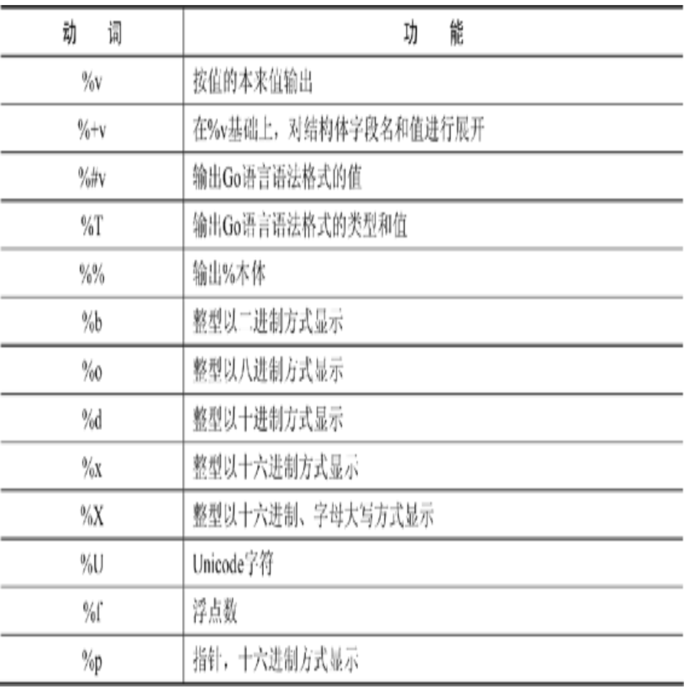

# 基本语法

## 变量

常见变量类型：整型，浮点型，布尔型，结构体等  

### 变量声明

```go
// 标准格式
var 变量名 变量类型

eg:
var a int

// 批量格式
var (
    a int
    b string
    c []float32
)

// 精简变量声明和初始化
eg:
var hp int = 100  // 标准写法
hp1 := 100 // 精简写法，要求左边的变量没有声明过，否则编译器会报错
```

### 匿名变量

多重赋值时，如果不需要在左值中接收变量，可以使用匿名变量
使用下划线 '_'

## 数据类型

整型，浮点型，布尔型，字符串  
切片，结构体，函数，map，通道（channel）等  

### 整型

 按长度分 | 对应无符号整型 
 :--:| :--:
 int8, int16, int32, int64 | uint8, uint16, uint32, uint64 

 int和uint --> 自动匹配特定平台整型长度

### 浮点型

float32 和 float64

### 布尔型

只有 true 和 false 两个值  
不允许将整型强制转换成布尔型

### 字符串

以原生数据类型出现

多行字符串： 使用反引号字符 “`”  

### 字符

使用单引号  

两种字符：  
- uint8 / byte， 代表一个ASCII码的一个字符
- rune， 代表一个UTF-8字符，实际是一个int32

fmt.Printf中的 %T 可以输出变量的实际类型  

### 切片 -- 能动态分配的空间

```go
// 声明方式
var name []T  // T代表切片元素类型，整型，浮点，布尔等

eg:
a := make([]int, 3)
```
使用 “:” 可以截取切片的一块（和python使用类型）  

## 强制类型转换

```go
T(表达式)  // T代表要转换的类型
```

## 指针

  两个核心概念：
  - 类型指针，允许对这个指针类型的数据进行修改
  - 切片，由指向起始元素的原始指针，元素数量和容量组成  

```go
取指针：    &
指针取值：  *
```

### 创建指针的另一种方法 -- new()函数

```go
new(类型)
eg:

str := new(string)
*str = "ninja"
fmt.Println(*str)
```

new()函数创建一个对应类型的指针，创建过程会分配内存  
被创建的指针指向的值为默认值  

### 变量逃逸（Escape Analysis）

编译器自动决定变量分配方式，堆或者栈分析  

## 字符串应用

### 字符串长度

```go
len() // 得到的字符串的ASCII字符个数或字节长度

// 计算UTF-8的字符个数

utf8.RuneCountInString()

// 对于中文
// len() 返回的是中文字数 * 3（UTF-8每个中文字符占3个字节）
// utf8.RuneCountInString() 返回的是实际的中文字数
```

### 遍历字符串

- ASCII字符串遍历直接使用下标
- Unicode字符串遍历用 for range
  
```go
theme := "shoot start"

for i := 0; i < len(theme); i++ {
    fmt.Printf("ascii: %c %d\n", theme[i], theme[i])
}

theme = "狙击 start"
for _, s := range theme {
		fmt.Printf("Unicode: %c  %d\n", s, s)
	}

```

### 字符串索引

- strings.Index     正向搜索子字符串
- strings.LastIndex 反向搜索子字符串
都是返回序号

### 修改字符串

Go语言中字符串默认不可变  
要修改的话需要通过先转化成切片后再转换成string

```go

angel := "Heros never die"

// 转化为切片
angelBytes := []byte(angle)

// 对angleBytes进行修改
......

// 修改后转换成string
angel = string(angelBytes)

```

### 连接字符串

- 使用 “+”
- 使用类似于 StringBuilder 的机制

```go
hammer := "吃我一锤"
sickle := "死吧"

// 声明字节缓存
var stringBuilder bytes.Buffer

// 将字符串写入缓冲
stringBuilder.WriteString(hammer)
stringBuilder.WriteString(sickle)

// 将缓冲以字符串形式输出
fmt.Println(stringBuilder.String())
```

### 格式化

```go
fmt.Sprintf(格式化样式， 参数列表...)
```


## 常量

使用关键字 const  
常量因为在编译期确定，所以可以用于数组声明

```go
const size = 4
var arr [size]int
```

### 枚举

Go语言中现阶段没有枚举  
通过使用常量配合iota模拟枚举  

```go
type Weapon int

const (
    Arrow Weapon = iota
    Shuriken
    SniperRifle
    Rifle
    Blower
)

// Arrow, Shuriken, SniperRifle, Rifle, Blower
// 依次被赋值为 0, 1, 2, 3, 4
```

## 类型别名

Go 1.9版本之前的内建类型定义
```go
type byte uint8
type rune int32
```

Go 1.9版本之后
```go
type byte = uint8
type rune = int32
```

### 类型别名和类型定义

```go
// 类型别名

type TypeAlias = Type

// 类型定义

type TypeDefine Type

// 类型别名的类型只会在代码中存在，编译完成后，不会有类型别名的类型
// 使用 %T 输出得到的是本质的类型
```

# 容器

## 数组

数组从声明时就确定，使用时可以修改数组成员，但是数组大小不可改变


### 声明和初始化

```go
var 数组变量名 [元素数量]Type

eg:

var team [3]string

var team = [3]string{"hammer", "soldier", "mum"}

// 让编译器在编译时，根据元素个数确定数组大小
var team = [...]string{"hammer", "soldier", "mum"}
```

### 遍历数组

```go
var team = [...]string{"hammer", "soldier", "mum"}

for index, value := range team {
    fmt.Println(index, value)
}
```

## 切片

从数组或切片生成新的切片

```go
slice[起始位置:结束位置]
```

### 声明切片

```go
var name []T
```

### 使用make()函数构造切片
```go
make([]Type, size, cap)

// Type：切片的元素类型
// size: 为这个类型分配多少元素
// cap:  预分配的元素数量
```

### 使用 append() 函数为切片添加元素

使用append()动态添加元素，每个切片都会指向一片内存空间，当空间不能容纳  足够多的元素时，切片就会进行“扩容”  

```go
append(slice, element)
```

### 复制切片元素到另一个切片

```go
copy( destSlice, srcSlice)
```

### 从切片中删除元素

使用append将 index 之前和之后的两个切片组合

```go
seq = append(seq[:index], seq[index+1:]...)
// ...表示把第二个切片全部接在第一个切片后
```

## 映射(map)

### 创建map

```go
map[KeyType]ValueType

eg:

scene := make(map[string]int)

scene["route"] = 66

v, ok := scene["route2"]
// 得到的结果v是0（默认值），ok的值是false

// 声明时填充内容
m := map[string]string{
    "W": "forward",
    "A": "left",
}
```

### 遍历map

```go
for key, value := range aMpa {
    ......
}
```

### delete()删除键值对

```go
delete(aMap, 键)
```

### 清空map

重新make一个新的map，Go没有提供清空所有元素的函数、方法  

## 列表

Go语言中，列表使用 container/list包实现，内部的实现原理是双链表  

### 初始化列表

```go

// New方法
变量名 := list.New()

// 声明
var 变量名 list.List
```

### 插入元素

PushFront()和PushBack()

```go
aList := list.New()
aList.PushBack("in the end")
aList.PushFront("in the front")
```


### 从列表中删除元素

列表的插入函数的返回值会提供一个 *list.Element结构，这个结构记录着列表元素的值  及和其他节点之间的关系等信息
从列表中删除元素时，需要用到这个结构进行快速删除

```go
element := aList.PushBack("fist")  // 此时element对应的元素值就是fist

aList.Remove(element)
```

### 遍历列表

配合Front()函数获取头元素，遍历时元素不为空就继续进行，每一次遍历调用元素的Next

```go
for i := aList.Front(); i != nil; i = i.Next() {
    fmt.Println(i.Value)
}
```

# 流程控制

| 流程类型 | 关键字 |
| :--: | :--: |
| 分支 | if, switch |
| 循环 | for |
| 跳转 | goto |
| 循环控制 | break, continue |

## if

特殊写法

  在if表达式之前添加一个执行语句，再根据变量值进行判断

```go
if err := Connect(); err != nil {
    fmt.Println(err)
    return
}
```

## for

## 键值循环 for range

| 数据类型 | for range返回值 |
| :--: | :--: |
| 数组，切片，字符串 | 索引和值 |
| map | 键和值 |
| channel | 只返回通道内的值 |

## 分支选择 switch

Go语言中的switch，不仅可以基于常量进行判断，还可以基于表达式进行判断  

```go
// 基本写法

switch a {
    case "hello":
        fmt.Println(1)
    case "world":
        fmt.Println(2)
    default:
        fmt.Println(0)
}


// 一分支多值

switch a {
    case "mum", "daddy":
        fmt.Println("family")
}

// 分支表达式

switch {
    case r > 10 && r < 20:
        fmt.Println(r)
}
```

### fallthrough

Go语言中case是一个独立的代码块，执行完毕后不会像C语言那样紧接着下一个case执行 
为了兼容一些移植代码，加入了fallthrough关键字实现这一个功能

```go
var s = "hello"
switch {
case s == "hello":
    fmt.Println("hello")
    fallthrough
case s != "world":
    fmt.Println("world")
}

// 输出结果是两个print都会执行
// 如果没有 fallthrough，只会执行第一个print
```

## goto 跳转

```go
func main() {

	for x := 0; x < 10; x++ {
		for y := 0; y < 10; y++ {
			if y == 2 {
				goto breakHere
			}
		}
	}

	return

breakHere:
	fmt.Println("done")
}
```

### break 和 continue

可以在 break 或 continue 后添加标签名，表示退出某个标签对应的代码块或者继续标签对应的循环


# 函数

## 普通函数

### 普通函数声明形式 

```go
func 函数名(参数列表) (返回值列表) {
    函数体
}

```

## 匿名函数

### 匿名函数声明方式

```go
func(参数列表) (返回参数列表) {
    函数体
}
```

## 函数类型实现接口


## 闭包(closure) —— 引用了外部变量的匿名函数

# 结构体（struct）

## 定义结构体

```go
type 类型名 struct {
    字段1 字段1类型
    字段2 字段2类型
    ...
}
```

## 实例化结构体

  结构体的定义只是一种内存布局的描述，只有当结构体实例化时，才会真正地分配内存

### 基本的实例化形式

```go
type Point struct {
    X int
    Y int
}

var p Point
p.X = 10
p.Y = 20
```

### 创建指针类型的结构体

```go
type Player struct {
    Name string
    HealthPoint int
    MagicPoint int
}

tank := new(Player)
tank.Name = "Canon"
tank.HealthPoint = 300
```

### 取结构体的地址实例化

  对结构体进行 “&” 取地址操作时，视为对该类型进行一次 new 的实例化操作

```go
insta := &T{}

eg:

type Command struct {
    Name string
    Var *int
    Comment string
}

var version int = 1

cmd := &Command{}

cmd.Name = "version"
cmd.Var = &version
cmd.Comment = "show version"
```


